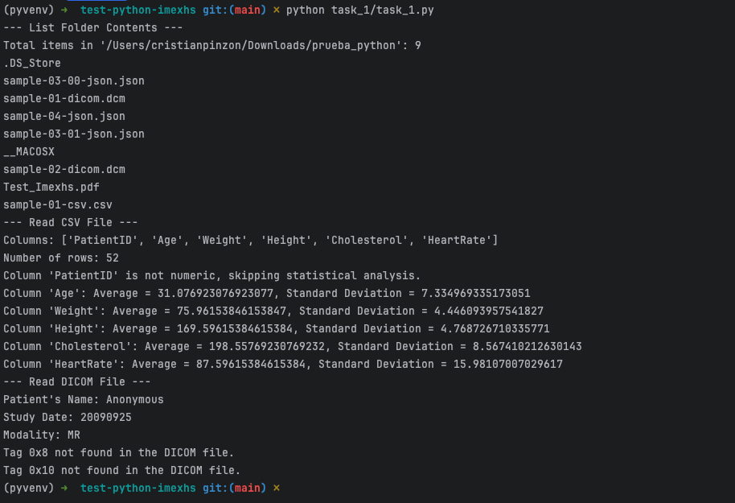
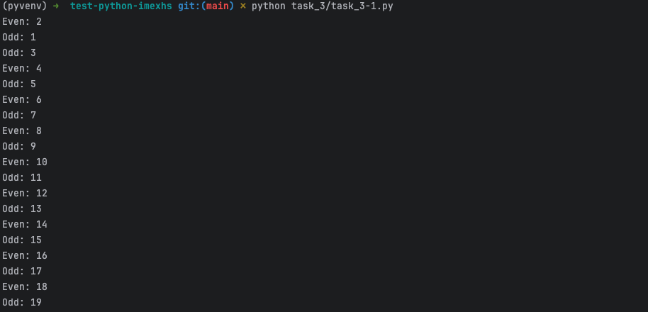
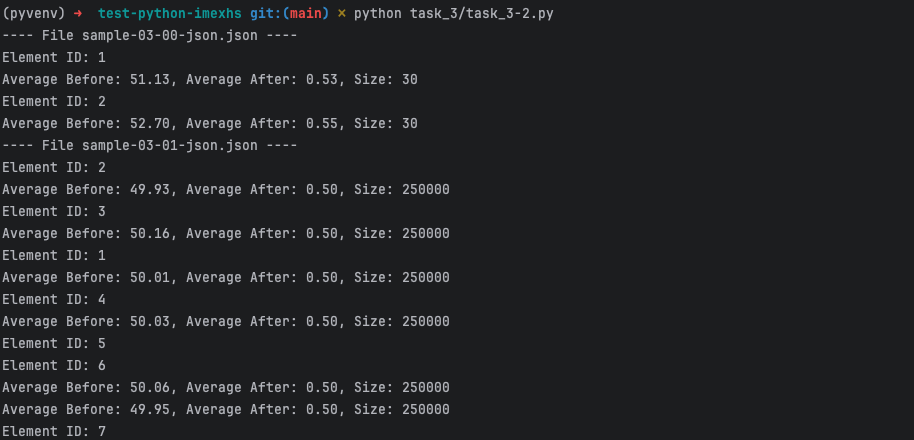
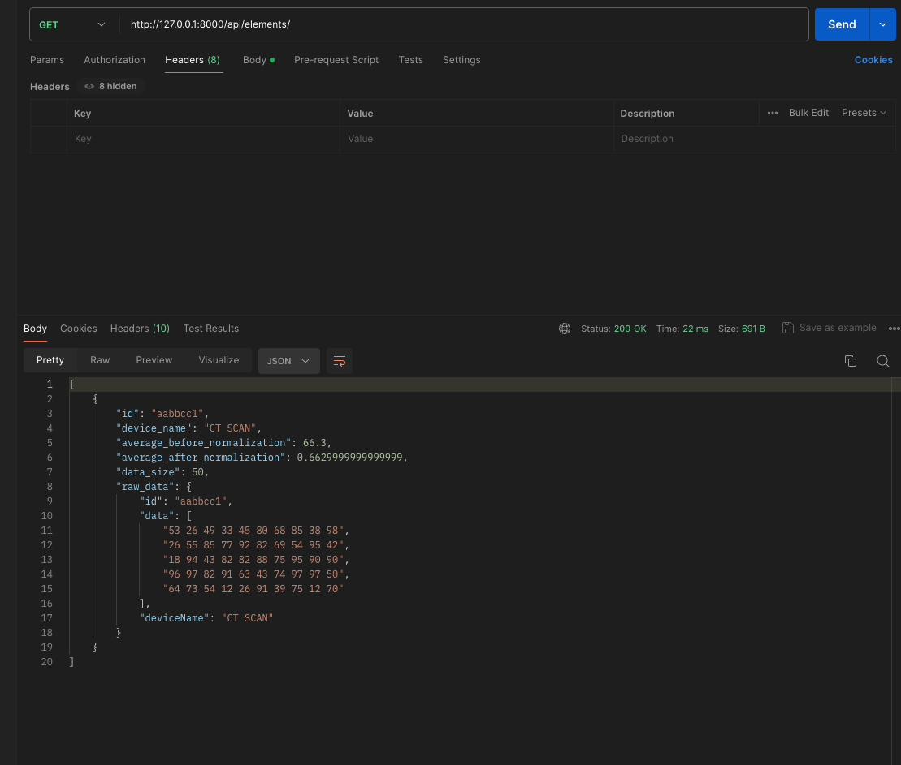
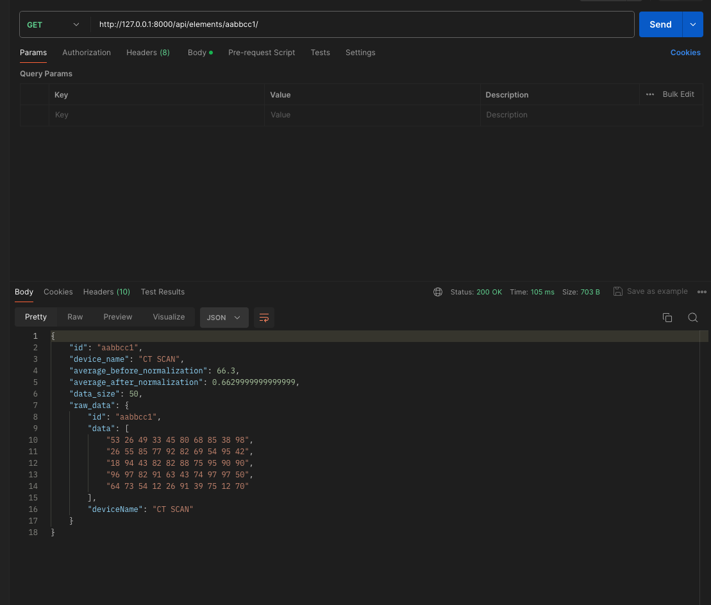

# Python test - imexhs


## Prerequisites
- Git installed
- PostgreSQL installed (including pgAdmin)
- Python installed
- Any installed code editor (Visual Studio Code, Pycharm, Vim, etc.)
- Postman installed (or other software that facilitates the use of requests)

## Installation
Clone this project to your computer in a specific location.
```bash
git clone https://github.com/faykris/test-python-imexhs.git
```
Go to the project folder and create a virtual environment, in this case the name will be **venv** and it should be activated running **activate** file

```bash
cd test-python-imexhs
python -m venv venv
source venv/bin/activate  # Activate in Unix/Mac
.\venv\Scripts\activate  # Activate in Windows
```
Create a new file in the root of the project named .env and access it this using your code editor, then add all environment variables with YOUR OWN values (depends where are located the example files' path and database access information)
```bash
touch .env
vim .env
```
```bash
FOLDER_PATH=/Users/MyUser/Downloads/prueba_python
POSTGRES_DB=postgres
POSTGRES_USER=postgres
POSTGRES_PASS=postgres
POSTGRES_HOST=localhost
POSTGRES_PORT=5432
```

Install the dependencies used in the different tasks of this test which are in the requirements.txt file
```bash
pip install -r requirements.txt
```

For the Task 4 (Django Project) you must migrate MedicalImageResult model to database using the following command inside of task_4 folder (where manage.py file is located). With this you have been created a new table in your specified DB
```bash
python manage.py makemigrations
python manage.py migrate
```


## Running Tasks
Now I will show you how you can run every task of this test:

### Task 1
Run the following command since the root project or execute directly through your code editor 
```bash
python task_1/task_1.py
```
The result will be something like this:


### Task 2
Run the following command since the root project or execute directly through your code editor
```bash
python task_2/task_2.py
```
The result will be something like this:


### Task 3.1
Run the following command since the root project or execute directly through your code editor
```bash
python task_3/task_3-1.py
```
The result will be something like this:


### Task 3.2
Run the following command since the root project or execute directly through your code editor
```bash
python task_3/task_3-2.py
```
The result will be something like this:


### Task 4
Go to the Task 4 folder and execute the following command to start Django project
```bash
cd task_4
python manage.py runserver
```
The server should be running like this:


Now I will show how work each endpoint on this task:

#### POST - Add new element

- http://127.0.0.1:8000/api/elements/

Example body:
```json
{
    "id": "aabbcc1",
    "data": [
        "53 26 49 33 45 80 68 85 38 98",
        "26 55 85 77 92 82 69 54 95 42",
        "18 94 43 82 82 88 75 95 90 90",
        "96 97 82 91 63 43 74 97 97 50",
        "64 73 54 12 26 91 39 75 12 70"
    ],
    "device_name": "CT SCAN",
    "raw_data": {
        "id": "aabbcc1",
        "data": [
            "53 26 49 33 45 80 68 85 38 98",
            "26 55 85 77 92 82 69 54 95 42",
            "18 94 43 82 82 88 75 95 90 90",
            "96 97 82 91 63 43 74 97 97 50",
            "64 73 54 12 26 91 39 75 12 70"
        ],
        "deviceName": "CT SCAN"
    }
}
```
Result:


#### GET - List all elements

- http://127.0.0.1:8000/api/elements/

Result:



#### GET - Specific element by id

- http://127.0.0.1:8000/api/elements/aabbcc1/

Result:


#### PUT - Update device name
- http://127.0.0.1:8000/api/elements/aabbcc1/

Example body:
```json
{
  "device_name": "CT SCAN UPDATED"
}
```
Result:


#### DELETE - Erase element
- http://127.0.0.1:8000/api/elements/aabbcc1/

Result:


### Task 5

- Go to the task_5 folder and open task_5.pdf

#### Explanation: 
Users enter the web portal and perform the upload of one or more medical images (DICOM files), the frontend will do the basic validations such as the one that includes at least one image.

Once uploaded, they are sent to a server where the load balancer redirects request to an available server where there is an orchestrator such as Kubernetes that creates a number of images depending on the load, which is monitored by Prometheus. It proceeds to validate the integrity of the DICOM files and to do other validations like user permissions and authentication.

Each docker image will have a backend in Django that will receive the image upload request, send a message to the messaging queue guaranteeing zero losses, and at the same time they will be saved or updated in a S3 bucket.

Once the message is added to the RabbitMQ queue, it is extracted by a second set of servers in charge of processing the images. Here, each server extracts the images from S3, processes them and stores their analysis on a distributed db system. This last process involves writing to the main db, and then the system will duplicate the information to the replicas.
Finally, once the analysis is ready, the servers add a second message to a second message queue notifying the success of the analysis.

Once the new event is stored in the queue, it will be extracted by the first set of servers and they will be in charge of notifying users that their analysis is ready. For this, the servers will send an email to the user and/or will use web-sockets to communicate to the front-end and inform about the successful operation.

In addition, the tasks executed by both sets of servers will be monitored through logs using a service such as AWS CloudWatch.

## Authors

- Cristian Pinzón - faykris28@gmail.com - https://faykris-portfolio.netlify.app/